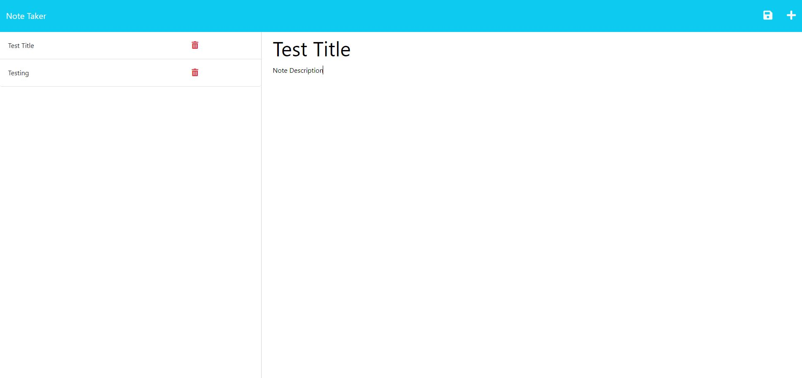

# Note Taker

## Description

This page will serve as a tool to save notes.

## Table of contents

-[Installation](#Installation)
-[Usage](#Usage)
-[Credits](#Credits)

## Installation

This page will be available on Heroku when their credits hit my account.
Othervise...
In the integrated terminal: run "npm i" and then "node ./server.js". Then click on the link presented into the terminal. You will then be presented with the notes webpage.

## Usage

This page shows the coding repository: https://github.com/KobyS82/Note-Taker

 

## Credits

Anirudh, for helping with routing, https://stackoverflow.com/questions/27465850/typeerror-router-use-requires-middleware-function-but-got-a-object

Web Dev Simplified, for helping with express.JS, https://www.youtube.com/watch?v=SccSCuHhOw0&t=852s
